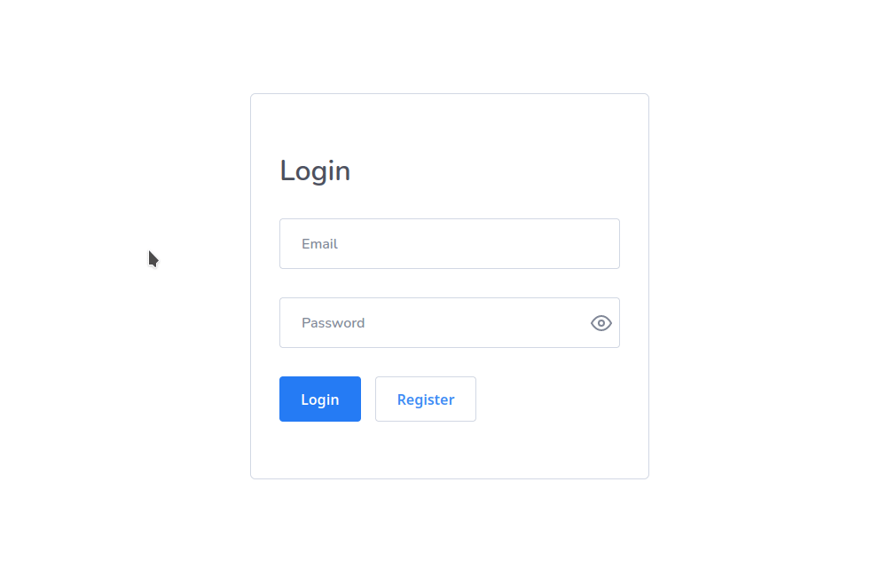

# clean-user-auth
A user auth application using Node.js and Next.js.



## Technologies

- Typescript
- Node.js | Express
- SQLite | TypeORM;
- Next.js
- Jest

## Run

```bash
# clone this repository

git clone https://github.com/camposvictor/clean-user-auth.git

```

### Run API

```bash
  cd server

  # install dependencies
  yarn
  # or
  npm install

  #run migrations
  yarn typeorm migration:run
```

Create a .env file on the project's root and configure your jwt secret key

```bash
SECRET_KEY=<YOUR_PRIVATE_KEY>
```

Run:
```bash
yarn dev

# running on port 3333
```

### Run Frontend


```bash
  cd client

  # install dependencies
  yarn
  # or
  npm install

  # run
  yarn dev

  # running on port 3000
```


